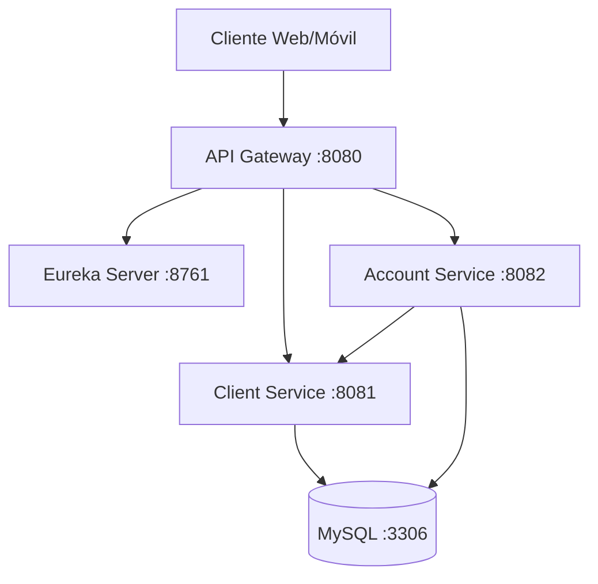

# 🏦 Banking Microservices Architecture

[](https://openjdk.java.net/)
[](https://spring.io/projects/spring-boot)
[](https://spring.io/projects/spring-cloud)
[](https://www.mysql.com/)
[](https://www.docker.com/)
[](https://maven.apache.org/)

Una arquitectura de microservicios bancarios moderna construida con Spring Boot, Spring Cloud, MySQL y Docker. Este proyecto implementa un sistema bancario completo con gestión de clientes, cuentas y movimientos financieros.

## 📋 Tabla de Contenidos

- [Arquitectura del Sistema](#-arquitectura-del-sistema)
- [Características Implementadas](#-características-implementadas)
- [Tecnologías Utilizadas](#-tecnologías-utilizadas)
- [Estructura del Proyecto](#-estructura-del-proyecto)
- [Prerrequisitos](#-prerrequisitos)
- [Instalación y Despliegue](#-instalación-y-despliegue)
- [Uso de la API](#-uso-de-la-api)
- [Base de Datos](#-base-de-datos)
- [Testing](#-testing)
- [Monitoreo y Logs](#-monitoreo-y-logs)
- [Comandos Útiles](#-comandos-útiles)
- [Troubleshooting](#-troubleshooting)

## 🏗️ Arquitectura del Sistema

El sistema está compuesto por los siguientes microservicios:



### Componentes Principales

| Servicio | Puerto | Descripción |
|----------|--------|-------------|
| **Eureka Server** | 8761 | Service Discovery y Registry |
| **API Gateway** | 8080 | Punto de entrada centralizado |
| **Client-Person Service** | 8081 | Gestión de clientes y personas |
| **Account-Movement Service** | 8082 | Gestión de cuentas y movimientos |
| **MySQL Database** | 3306 | Base de datos principal |

## ✨ Características Implementadas

### 🔧 Funcionalidades Core

- **✅ CRUD Completo**: Operaciones completas para clientes, cuentas y movimientos
- **💰 Gestión de Movimientos**: Depósitos y retiros con validación de saldo
- **📊 Reportes**: Estados de cuenta por cliente y rango de fechas
- **🔒 Validaciones**: Validación robusta de datos de entrada
- **⚡ Microservicios**: Arquitectura distribuida y escalable

### 🛡️ Características Técnicas

- **Service Discovery**: Registro automático de servicios con Eureka
- **API Gateway**: Enrutamiento centralizado y balanceamiento de carga
- **Base de Datos**: Esquema normalizado con relaciones optimizadas
- **Docker**: Containerización completa para fácil despliegue
- **Testing**: Cobertura de pruebas unitarias e integración
- **Logging**: Sistema de logs estructurado
- **Validación**: Validaciones de negocio y datos

## 🛠️ Tecnologías Utilizadas

### Backend
- **Java 17** - Lenguaje de programación
- **Spring Boot 3.2.0** - Framework principal
- **Spring Cloud 2023.0.0** - Microservicios
- **Spring Data JPA** - Persistencia de datos
- **Spring Web** - APIs REST
- **Spring Security** - Autenticación y autorización

### Base de Datos
- **MySQL 8.0** - Base de datos relacional
- **JPA/Hibernate** - ORM

### Infraestructura
- **Docker & Docker Compose** - Containerización
- **Maven** - Gestión de dependencias
- **Eureka** - Service Discovery
- **Spring Cloud Gateway** - API Gateway

### Testing
- **JUnit 5** - Framework de testing
- **Mockito** - Mocking framework
- **Spring Boot Test** - Testing de integración

## 📁 Estructura del Proyecto

```
banking-microservices/
├── 📁 eureka-server/                 # Service Discovery
│   ├── src/main/java/com/banking/eureka/
│   ├── Dockerfile
│   └── pom.xml
├── 📁 api-gateway/                   # API Gateway
│   ├── src/main/java/com/banking/gateway/
│   ├── Dockerfile
│   └── pom.xml
├── 📁 client-person-service/         # Servicio de Clientes
│   ├── src/main/java/com/banking/client/
│   │   ├── controller/               # REST Controllers
│   │   ├── service/                  # Business Logic
│   │   ├── entity/                   # JPA Entities
│   │   ├── repository/               # Data Access
│   │   └── dto/                      # Data Transfer Objects
│   ├── src/test/java/                # Unit Tests
│   ├── Dockerfile
│   └── pom.xml
├── 📁 account-movement-service/      # Servicio de Cuentas
│   ├── src/main/java/com/banking/account/
│   │   ├── controller/               # REST Controllers
│   │   ├── service/                  # Business Logic
│   │   ├── entity/                   # JPA Entities
│   │   ├── repository/               # Data Access
│   │   ├── dto/                      # Data Transfer Objects
│   │   └── feign/                    # Feign Clients
│   ├── src/test/java/                # Unit Tests
│   ├── Dockerfile
│   └── pom.xml
├── 📄 docker-compose.yml             # Orquestación de servicios
├── 📄 build.sh                       # Script de construcción
├── 📄 BaseDatos.sql                  # Esquema de base de datos
├── 📄 Banking-API.postman_collection.json  # Colección de API
└── 📄 pom.xml                        # POM principal
```

## 📋 Prerrequisitos

Antes de ejecutar el proyecto, asegúrate de tener instalado:

### Software Requerido
- **Java 17** o superior
- **Maven 3.6** o superior
- **Docker** y **Docker Compose**
- **Git** (para clonar el repositorio)

### Verificar Instalaciones
```bash
# Verificar Java
java -version

# Verificar Maven
mvn -version

# Verificar Docker
docker --version
docker-compose --version
```

## 🚀 Instalación y Despliegue

### Opción 1: Despliegue Automático (Recomendado)

El proyecto incluye un script de construcción automatizado que maneja todo el proceso:

```bash
# 1. Clonar el repositorio
git clone <repository-url>
cd banking-microservices

# 2. Ejecutar el script de construcción
chmod +x build.sh
./build.sh
```

El script `build.sh` realizará automáticamente:
- ✅ Verificación de prerrequisitos
- 🔨 Compilación de todos los microservicios
- 🐳 Construcción de imágenes Docker
- 🗄️ Inicialización de la base de datos
- 🧪 Ejecución de pruebas
- 🚀 Despliegue de todos los servicios

### Opción 2: Despliegue Manual

Si prefieres un control más granular:

```bash
# 1. Construir todos los microservicios
mvn clean package -DskipTests

# 2. Construir imágenes Docker
docker-compose build

# 3. Inicializar base de datos
docker-compose up -d mysql
sleep 10
docker exec -i banking-mysql mysql -u root -proot < BaseDatos.sql

# 4. Desplegar todos los servicios
docker-compose up -d
```

### Verificar el Despliegue

Una vez completado el despliegue, verifica que todos los servicios estén funcionando:

```bash
# Verificar estado de contenedores
docker-compose ps

# Verificar logs
docker-compose logs -f

# Verificar conectividad
curl http://localhost:8080/actuator/health
```

## 🌐 Uso de la API

### Endpoints Principales

#### 🔍 Service Discovery
- **Eureka Dashboard**: http://localhost:8761

#### 👥 Gestión de Clientes
- **Base URL**: http://localhost:8080/clientes
- **Crear Cliente**: `POST /clientes`
- **Listar Clientes**: `GET /clientes`
- **Obtener Cliente**: `GET /clientes/{id}`
- **Actualizar Cliente**: `PUT /clientes/{id}`
- **Eliminar Cliente**: `DELETE /clientes/{id}`

#### 💳 Gestión de Cuentas
- **Base URL**: http://localhost:8080/cuentas
- **Crear Cuenta**: `POST /cuentas`
- **Listar Cuentas**: `GET /cuentas`
- **Obtener Cuenta**: `GET /cuentas/{id}`
- **Actualizar Cuenta**: `PUT /cuentas/{id}`
- **Eliminar Cuenta**: `DELETE /cuentas/{id}`

#### 💰 Gestión de Movimientos
- **Base URL**: http://localhost:8080/movimientos
- **Crear Movimiento**: `POST /movimientos`
- **Listar Movimientos**: `GET /movimientos`
- **Movimientos por Cuenta**: `GET /movimientos/cuenta/{cuentaId}`
- **Movimientos por Cliente**: `GET /movimientos/cliente/{clienteId}`

#### 📊 Reportes
- **Base URL**: http://localhost:8080/reportes
- **Estado de Cuenta**: `GET /reportes/estado-cuenta/{clienteId}?fechaInicio={fecha}&fechaFin={fecha}`

### Ejemplo de Uso con cURL

```bash
# Crear un cliente
curl -X POST http://localhost:8080/clientes \
  -H "Content-Type: application/json" \
  -d '{
    "nombre": "Juan Pérez",
    "genero": "M",
    "edad": 30,
    "identificacion": "12345678",
    "direccion": "Calle 123 #45-67",
    "telefono": "3001234567",
    "contrasena": "password123",
    "estado": true
  }'

# Crear una cuenta
curl -X POST http://localhost:8080/cuentas \
  -H "Content-Type: application/json" \
  -d '{
    "numeroCuenta": "123456",
    "tipoCuenta": "Ahorro",
    "saldoInicial": 1000000.00,
    "estado": true,
    "clienteId": 1
  }'

# Realizar un depósito
curl -X POST http://localhost:8080/movimientos \
  -H "Content-Type: application/json" \
  -d '{
    "tipoMovimiento": "Deposito",
    "valor": 500000.00,
    "cuentaId": 1
  }'
```

### Colección de Postman

Importa la colección `Banking-API.postman_collection.json` en Postman para tener acceso a todos los endpoints con ejemplos preconfigurados.

## 🗄️ Base de Datos

### Esquema de Base de Datos

El sistema utiliza MySQL con el siguiente esquema:

```sql
-- Tabla de personas (base)
personas (persona_id, nombre, genero, edad, identificacion, direccion, telefono)

-- Tabla de clientes (extiende personas)
clientes (persona_id, cliente_id, contrasena, estado)

-- Tabla de cuentas
cuentas (cuenta_id, numero_cuenta, tipo_cuenta, saldo_inicial, estado, cliente_id)

-- Tabla de movimientos
movimientos (movimiento_id, fecha, tipo_movimiento, valor, saldo, cuenta_id)
```

### Información de Conexión

| Parámetro | Valor |
|-----------|-------|
| **Host** | localhost |
| **Puerto** | 3306 |
| **Base de Datos** | banking_db |
| **Usuario** | banking_user |
| **Contraseña** | banking_password |
| **Root Password** | root |

### Comandos de Base de Datos

```bash
# Conectar a MySQL
docker exec -it banking-mysql mysql -u banking_user -p banking_db

# Ver tablas
SHOW TABLES;

# Ver estructura de una tabla
DESCRIBE personas;

# Ver datos de ejemplo
SELECT * FROM personas LIMIT 5;
```

## 🧪 Testing

### Ejecutar Pruebas

```bash
# Ejecutar todas las pruebas
mvn test

# Ejecutar pruebas de un servicio específico
cd client-person-service
mvn test

# Ejecutar pruebas con cobertura
mvn test jacoco:report
```

### Tipos de Pruebas

- **Unit Tests**: Pruebas de lógica de negocio en servicios
- **Integration Tests**: Pruebas de controladores y APIs
- **Repository Tests**: Pruebas de acceso a datos

### Cobertura de Pruebas

El proyecto incluye pruebas para:
- ✅ Servicios de negocio
- ✅ Controladores REST
- ✅ Repositorios de datos
- ✅ Validaciones de entrada
- ✅ Manejo de errores

## 📊 Monitoreo y Logs

### Ver Logs en Tiempo Real

```bash
# Ver logs de todos los servicios
docker-compose logs -f

# Ver logs de un servicio específico
docker-compose logs -f client-person-service

# Ver logs de base de datos
docker logs banking-mysql
```

### Health Checks

```bash
# Verificar salud de la aplicación
curl http://localhost:8080/actuator/health

# Verificar servicios registrados en Eureka
curl http://localhost:8761/eureka/apps
```

### Métricas de Rendimiento

- **Eureka Dashboard**: http://localhost:8761
- **Spring Boot Actuator**: http://localhost:8080/actuator

## 🔧 Comandos Útiles

### Gestión de Servicios

```bash
# Iniciar todos los servicios
docker-compose up -d

# Detener todos los servicios
docker-compose down

# Reiniciar un servicio específico
docker-compose restart client-person-service

# Ver estado de servicios
docker-compose ps

# Ver logs de un servicio
docker-compose logs -f api-gateway
```

### Gestión de Base de Datos

```bash
# Conectar a MySQL
docker exec -it banking-mysql mysql -u banking_user -p banking_db

# Hacer backup de la base de datos
docker exec banking-mysql mysqldump -u banking_user -p banking_db > backup.sql

# Restaurar base de datos
docker exec -i banking-mysql mysql -u banking_user -p banking_db < backup.sql
```

### Desarrollo

```bash
# Compilar proyecto
mvn clean compile

# Ejecutar tests
mvn test

# Generar JAR
mvn clean package

# Limpiar proyecto
mvn clean
```

## 🐛 Troubleshooting

### Problemas Comunes

#### 1. Puerto ya en uso
```bash
# Verificar qué proceso usa el puerto
lsof -i :8080

# Detener proceso
kill -9 <PID>
```

#### 2. Error de conexión a base de datos
```bash
# Verificar que MySQL esté corriendo
docker-compose ps mysql

# Reiniciar MySQL
docker-compose restart mysql
```

#### 3. Servicios no se registran en Eureka
```bash
# Verificar logs de Eureka
docker-compose logs eureka-server

# Verificar configuración de red
docker network ls
```

#### 4. Error de memoria insuficiente
```bash
# Aumentar memoria para Docker
# En Docker Desktop: Settings > Resources > Memory
```

### Logs de Debug

```bash
# Habilitar logs detallados
export SPRING_PROFILES_ACTIVE=debug
docker-compose up -d
```

## 🤝 Contribución

### Cómo Contribuir

1. Fork el proyecto
2. Crea una rama para tu feature (`git checkout -b feature/AmazingFeature`)
3. Commit tus cambios (`git commit -m 'Add some AmazingFeature'`)
4. Push a la rama (`git push origin feature/AmazingFeature`)
5. Abre un Pull Request

### Estándares de Código

- Sigue las convenciones de Java
- Escribe tests para nuevas funcionalidades
- Documenta APIs con comentarios Javadoc
- Mantén cobertura de tests > 80%

## 📄 Licencia

Este proyecto está bajo la Licencia MIT. Ver el archivo `LICENSE` para más detalles.

## 👥 Autores

- **Tu Nombre** - *Desarrollo inicial* - [GitHub](https://github.com/tu-usuario)

## 🙏 Agradecimientos

- Spring Framework Team
- Docker Community
- MySQL Team
- Todos los contribuidores de código abierto

---

## 📞 Soporte

Si tienes preguntas o necesitas ayuda:

- 📧 Email: tu-email@ejemplo.com
- 🐛 Issues: [GitHub Issues](https://github.com/tu-usuario/banking-microservices/issues)
- 📖 Documentación: [Wiki del Proyecto](https://github.com/tu-usuario/banking-microservices/wiki)

---

**¡Gracias por usar Banking Microservices! 🏦✨**
